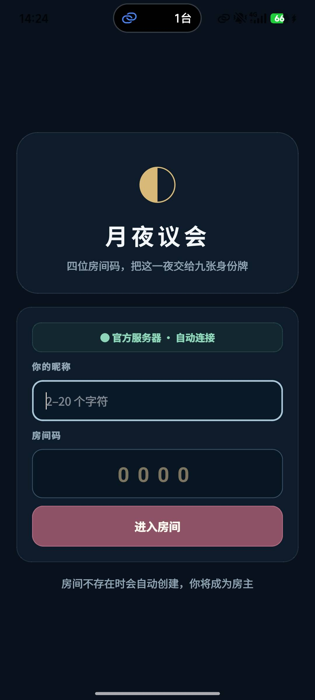
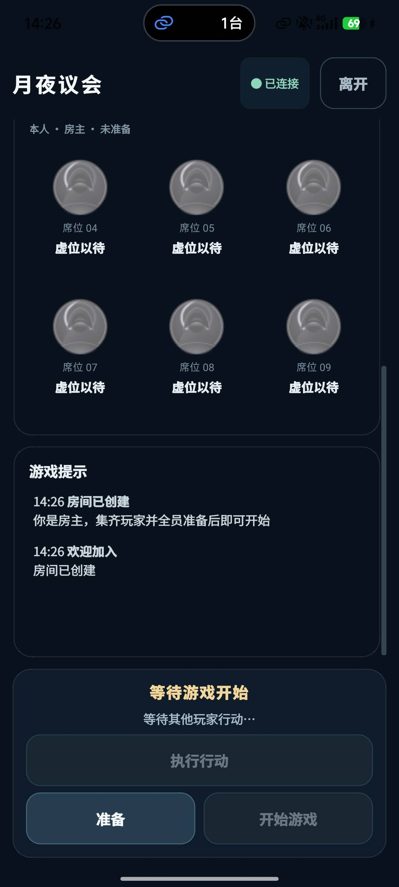

# 月夜议会 · 一夜终极狼人杀

本仓库已经从单房间演示版改造成可并发运行多房间、可用 Docker 部署、适配 Qt Android 竖屏操作的试玩版本。当前角色技能、夜晚顺序、牌组、投票与胜负判定以本文“游戏规则”章节为准；工程改造集中在房间状态承载、网络协议、客户端呈现和部署层。

## 工程结构

```text
wolf_game/
├── server/                      # 标准 C++ TCP 服务端
│   ├── include/                 # Room、RoomManager、规则接口
│   ├── src/                     # 网络、流程与原有游戏逻辑
│   └── tests/                   # 房间单元测试与多房间黑盒测试
├── client/                      # Qt 6 Widgets / Android 客户端
│   ├── headers/
│   ├── sources/
│   ├── resources/
│   └── android/
├── docker/
│   ├── server/Dockerfile        # Alpine 多阶段运行时镜像
│   └── android_builder/         # 可选 Qt Android 构建镜像与脚本
├── docs/
├── docker-compose.yml
└── .env.example
```

## 界面预览

客户端采用深色月夜主题，并针对 Android 竖屏与触控操作进行了适配。加入页保持输入简单，房间页集中展示玩家席位、准备状态、游戏提示和房主操作。

| 加入房间 | 房间与准备 |
|:---:|:---:|
|  |  |
| 输入昵称和四位房间码，自动连接服务器并创建或加入房间。 | 实时查看席位与准备状态；全员准备后由房主开始游戏。 |

## 一条命令启动服务端

全新 Linux 主机只需安装 Docker 与 Docker Compose：

```bash
docker compose up -d --build
docker compose logs -f server
```

默认监听 `TCP 8888`。动态改为 `9999`：

```bash
GAME_PORT=9999 docker compose up -d --build
```

PowerShell：

```powershell
$env:GAME_PORT = "9999"
docker compose up -d --build
```

服务端只使用标准 C++ Socket，最终镜像基于 Alpine，仅包含剥离符号后的可执行文件、`libstdc++` 与时区数据；构建目录、源码、`.o`、`.moc` 不会进入运行时镜像。日志写入命名卷 `wolf-game-logs` 的 `/var/log/werewolf/server.log`。

### 环境变量

| 变量 | 默认值 | 说明 |
|---|---:|---|
| `GAME_PORT` | `8888` | TCP 监听与 Compose 映射端口 |
| `GAME_BACKLOG` | `128` | Socket listen backlog |
| `GAME_MAX_CONNECTIONS` | `1024` | 全服并发 TCP 连接上限 |
| `GAME_MAX_ROOMS` | `0` | 房间数上限，`0` 表示不限制 |
| `GAME_PHASE_SECONDS` | `60` | 每个夜间角色阶段时长 |
| `GAME_DISCUSSION_SECONDS` | `60` | 白天讨论时长 |
| `GAME_READY_TIMEOUT_SECONDS` | `300` | 未开局房间无状态变化后的解散时间，`0` 禁用 |
| `GAME_LOG_FILE` | `/var/log/werewolf/server.log` | 日志文件路径 |

同样支持命令行参数，例如：

```bash
./server --port=9999 --max-connections=2048 --max-rooms=0 \
  --phase-seconds=60 --discussion-seconds=60 --ready-timeout-seconds=300
```

## 房间流程

1. 客户端连接后发送四位数字房间码和昵称。
2. 房间不存在时自动创建，首位玩家成为房主；存在且未开始时加入。
3. 房间固定最多 9 人，少于 7 人不能开局。
4. 玩家可准备/取消准备；只有房主能在至少 7 人且全员准备时开始。
5. 每个房间拥有独立玩家、牌组、角色、阶段、技能与投票状态，其他房间不受影响。
6. 开局前房主掉线会自动移交；游戏中任意玩家掉线会安全解散当前房间并给其他玩家提示。
7. 正常结算后保留房间连接，清空局内身份和行动状态，所有玩家重新准备即可开始下一局。

## 游戏规则

本节描述的是本项目当前实际执行的规则。不同桌游版本可能在平票、无人出局、场上无狼或部分角色细节上存在差异，联机对局以本节和客户端提示为准。

### 游戏目标与三个身份概念

一局游戏只经历一个夜晚。玩家在夜晚依次使用角色能力，天亮后讨论并投票放逐一名玩家，随后立即结算胜利阵营。

游戏中需要区分三个概念：

- **初始身份**：开局发到玩家手中的角色。夜晚行动资格通常由初始身份决定。
- **最终身份**：经过强盗、捣蛋鬼、酒鬼等换牌后，玩家在结算时实际持有的身份牌。
- **幽灵有效身份**：当前持有“幽灵”牌的玩家，结算时视为幽灵本局复制到的角色，并显示为 `幽灵-角色`。这个身份会随着幽灵牌的移动而移动。

除角色特别说明外，玩家只知道自己的初始身份，不会自动得知夜晚后自己的最终身份。因此讨论时需要根据发言和行动线索推断身份牌是否发生过交换。

当前阵营划分：

- **好人阵营**：预言家、强盗、捣蛋鬼、酒鬼、失眠者、揭示者、平民，以及没有完成复制的裸幽灵。
- **狼人阵营**：狼人1、狼人2和爪牙。爪牙不是狼人牌，但当前版本中爪牙被放逐仍判定狼人阵营胜利。
- **皮匠阵营**：皮匠独立获胜，目标是让皮匠身份在投票中被放逐。
- **幽灵阵营归属**：完成复制后不再固定属于好人阵营，而是继承复制身份的阵营。

### 游戏人数、牌组与底牌

每局使用“玩家人数 + 3”张牌。洗牌后每名玩家获得一张初始身份，剩余三张牌放在桌面中央，称为底牌。

| 人数 | 本局使用的全部角色牌 |
|---:|---|
| 7 人 | 狼人1、狼人2、爪牙、捣蛋鬼、强盗、预言家、酒鬼、失眠者、幽灵、皮匠 |
| 8 人 | 7 人牌组，再加入揭示者 |
| 9 人 | 8 人牌组，再加入平民 |

所有角色牌都会参与洗牌，因此任何角色都可能进入三张底牌。牌组中即使有两张狼人牌，场上也可能出现零名、一名或两名初始狼人。

### 一局游戏的完整流程

1. **进入房间**：输入昵称和相同的四位房间码。房间不存在时自动创建，创建者成为房主。
2. **准备开局**：房间人数必须达到 7 至 9 人，且所有玩家都已准备。只有房主可以点击“开始游戏”。
3. **发放身份**：服务器洗牌、向每名玩家私下发送初始身份，并留下三张底牌。
4. **夜晚行动**：服务器按照固定角色顺序推进。当前需要行动的玩家获得可操作按钮，其他玩家只能等待。
5. **白天讨论**：夜晚结束后所有玩家自由交流。默认讨论时间为 60 秒，可由服务器配置修改。
6. **投票放逐**：讨论结束后，每名玩家提交一张选票。所有人投票完成后立即结算。
7. **公布结果**：客户端显示胜利阵营、所有玩家的初始身份、最终身份和得票数。
8. **准备下一局**：结果展示约 3 秒后房间重置。连接不会断开，但所有玩家需要重新准备。

默认情况下，每个夜晚角色阶段持续 60 秒。即使某个角色位于底牌、场上无人能够行动，该阶段仍会按顺序出现并在计时结束后进入下一阶段。

### 夜晚行动顺序

夜晚严格按照下表从上到下执行。身份牌在夜晚被交换后不会改变行动顺序；普通角色是否行动主要看开局时的初始身份。

| 顺序 | 阶段 | 当前实现中的行动规则 |
|---:|---|---|
| 1 | 幽灵 | 选择一名其他玩家，查看并复制其**初始身份**。部分角色能力会立即执行，详见“幽灵规则”。 |
| 2 | 狼人 | 初始狼人确认其他初始狼人。若场上只有一名初始狼人，该狼人可以查看一张底牌。 |
| 3 | 爪牙 | 初始爪牙以及复制爪牙的幽灵会得知场上初始狼人的席位；如果两张狼人牌都在底牌，会收到场上无初始狼人的提示。 |
| 4 | 预言家 | 二选一：查看一名其他玩家的初始身份，或者查看三张底牌中的两张。 |
| 5 | 强盗 | 可以选择一名其他玩家交换身份牌，并得知自己抢到的身份；也可以跳过。被抢玩家不会立即得知身份变化。 |
| 6 | 捣蛋鬼 | 选择两名不同的其他玩家，交换他们的身份牌。捣蛋鬼只知道交换成功，不会看到两张牌的内容。 |
| 7 | 酒鬼 | 选择一张底牌与自己的身份牌交换，但不能查看换到的身份。 |
| 8 | 失眠者 | 查看自己经过前面所有换牌后的最终牌面身份。如果拿到幽灵牌，当前提示显示“幽灵”，不会展开为 `幽灵-复制身份`。 |
| 9 | 揭示者 | 选择一名其他玩家查看其当前牌面身份。如果牌面身份被判定为好人，天亮时向全场公开；狼人、爪牙或皮匠等特殊身份只向揭示者本人显示。幽灵牌在此阶段按牌面“幽灵”处理。 |

没有主动夜晚技能的角色：

- **平民**：没有夜晚能力，目标是协助好人找出最终狼人。
- **皮匠**：没有夜晚能力，目标是让自己在投票中被放逐。
- **爪牙**：只接收狼人席位信息，不操作其他玩家的牌。

### 幽灵规则

幽灵是本项目中最容易混淆的角色，按以下顺序理解：

1. 幽灵阶段选择一名其他玩家，并复制该玩家的初始身份。
2. 幽灵牌本身仍然是一张可以被交换的实体身份牌，但它的**有效身份**已经变成复制到的角色。
3. 结算时，最终持有幽灵牌的玩家按复制身份参与阵营与胜负判断，并显示为 `幽灵-复制身份`。
4. 如果幽灵牌后来被强盗或捣蛋鬼移动，复制身份也跟随幽灵牌移动，不再绑定最初拿到幽灵的玩家。

幽灵复制不同角色后的行为：

- 复制预言家、强盗、捣蛋鬼、酒鬼或揭示者：在幽灵阶段立即使用对应能力。
- 幽灵-预言家选择查看底牌时，当前版本固定返回底牌 1 和底牌 2。
- 复制爪牙：在爪牙阶段得知初始狼人席位。
- 复制失眠者：在失眠者阶段确认自己的最终身份。
- 复制狼人、皮匠、平民等无即时按钮的角色：幽灵阶段完成复制后等待，结算阵营仍按复制身份计算。

当前版本中，狼人互认名单只根据开局时的初始狼人牌生成。幽灵复制狼人后会在最终结算中视为狼人，但不会被加入初始狼人互认名单。

还需要注意“能力归属”和“结算身份”是两件事：

- 幽灵复制身份后，后续爪牙/失眠者信息仍发送给最初执行复制的幽灵玩家；幽灵牌后来被别人拿走，不会把这次夜晚知情能力转交给新持牌人。
- 普通强盗抢到幽灵牌时，当前私密提示只会告诉他抢到了“幽灵”，不会提前透露幽灵复制了什么。
- 失眠者最终拿到幽灵牌时，当前私密提示同样只显示“幽灵”；完整的 `幽灵-复制身份` 会在最终结算公开。
- 揭示者查看幽灵牌时按牌面“幽灵”处理并可在天亮公开；即使它的结算有效身份是狼人或皮匠，揭示阶段也不会提前展开复制身份。

如果幽灵初始位于三张底牌，就没有玩家执行复制。之后若酒鬼拿到这张未复制的幽灵牌，它仍显示为“幽灵”，按普通好人身份结算。

如果幽灵已经复制角色后又把幽灵牌换进底牌，复制记录仍然保留，但在没有玩家持有幽灵牌期间不会影响任何玩家的结算。若后续酒鬼又把这张牌从底牌换回玩家区域，复制身份会重新随幽灵牌生效。

#### 幽灵复制强盗示例

假设 1 号初始身份是幽灵，复制了强盗，然后抢走 2 号玩家当前持有的狼人1：

| 玩家 | 初始身份 | 夜晚后的最终身份 | 结算含义 |
|---|---|---|---|
| 1 号 | 幽灵 | 狼人1 | 1 号拿到了狼人牌，最终按狼人判断 |
| 2 号 | 狼人1 | 幽灵-强盗 | 2 号拿到幽灵牌，最终按强盗、好人阵营判断 |

此后如果幽灵牌又被其他技能交换给 3 号，那么最终显示 `幽灵-强盗`、并按强盗判断的人也会变成 3 号。

### 投票与放逐规则

- 每名玩家只能提交一票，投票后不能修改。
- 可以投给包括自己在内的任意有效席位。
- 必须等本局所有玩家都完成投票，服务器才会结算；如果游戏中有人掉线，房间会直接解散，不会由剩余玩家继续投票。
- 服务器找出最高票玩家并放逐一人；当前版本没有“至少两票才出局”的门槛。
- 如果多人并列最高票，当前版本不会让所有平票玩家同时出局，而是按照下面的优先级选出一人：

```text
皮匠 > 好人角色 > 狼人 > 其他角色
```

“其他角色”当前主要指爪牙；所有玩家都按夜晚结束后的最终有效身份进入上述分类。同一优先级中仍并列时，当前代码没有规定玩家可依赖的次级规则，不能假设一定按席位、昵称或投票先后决定。幽灵牌参与优先级和胜负判断时使用其复制身份，而不是未修饰的“幽灵”名称。

### 胜负判定

服务器根据被放逐玩家的**最终有效身份**判断胜利阵营：

| 被放逐玩家的最终有效身份 | 胜利结果 |
|---|---|
| 皮匠，或幽灵-皮匠 | 皮匠阵营胜利 |
| 狼人1、狼人2、幽灵-狼人1、幽灵-狼人2 | 好人阵营胜利 |
| 预言家、强盗、捣蛋鬼、酒鬼、失眠者、揭示者、平民、未复制的幽灵、幽灵-对应好人角色 | 狼人阵营胜利 |
| 爪牙或幽灵-爪牙 | 狼人阵营胜利 |

当前版本没有单独处理“场上没有最终狼人”的特殊胜利条件；只要被放逐者不是皮匠或狼人，就判定狼人阵营胜利。如果因为异常情况没有产生有效放逐目标，同样判定狼人阵营胜利。

> 注意：以上投票与胜负规则是本项目当前实现，和部分线下桌游版本的“最高票全部出局”“一人一票时无人出局”或“场上无狼时无人死亡则好人获胜”等规则不同。

### 掉线和房间重置

- 开局前玩家离开时，其他玩家会保留在房间内；房主离开后房主权限自动转移。
- 游戏进行中任意玩家掉线，当前房间会被解散，避免缺少玩家导致夜晚行动或投票永久等待。
- 某个未开局房间长时间没有状态变化时，服务器可以按 `GAME_READY_TIMEOUT_SECONDS` 自动清理。
- 正常结算后房间可以继续复用，所有玩家重新准备即可开始下一局。

## 本地编译

### 服务端

```bash
cmake -S server -B server/build -DCMAKE_BUILD_TYPE=Release
cmake --build server/build --parallel
ctest --test-dir server/build --output-on-failure
./server/build/server --port=8888
```

### Qt 客户端

需要 Qt 6（Core、Gui、Widgets、Network、Svg）：

```bash
mkdir -p client/build
cd client/build
qmake ../WerewolfClient.pro CONFIG+=release
make -j
```

Android 使用 Qt Creator 选择 `Android arm64-v8a` Kit 即可。应用已固定竖屏，客户端固定连接 `101.201.81.53:8888`，加入页仅校验昵称和四位数字房间码。

## 可选：容器内构建 Android APK

Android 镜像包含 JDK 17、Android SDK 35、NDK r27c、Qt Desktop host tools 和 Qt Android arm64 库。首次构建需要下载较大依赖：

```bash
docker compose --profile android build android-builder
docker compose --profile android run --rm android-builder
```

产物输出到宿主机 `artifacts/WerewolfClient-arm64-v8a.apk`。未提供发布证书时脚本会生成 Android 调试证书并签名；发布构建可在 `.env` 中配置 `ANDROID_KEYSTORE`、别名和密码。该可选镜像依赖 Qt/Android 官方下载服务，未被普通 `docker compose up` 构建或启动。

## 客户端体验

- 客户端内置公网服务器地址，加入页只需填写昵称和四位房间码。
- 房间卡显示房间码、在线人数、准备人数、房主和本人席位。
- 身份卡始终显示本局初始身份；幽灵复制结果作为辅助说明显示。
- 月相阶段卡明确区分夜晚行动、白天讨论、投票和结算。
- 只有当前需要行动的玩家获得可用操作入口；其他玩家显示“等待其他玩家行动…”。
- 游戏提示区只展示整理后的用户消息，不展示原始包、进程号或 `DEBUG` 文本。
- 结算卡显示胜利阵营、全员初始/最终身份和得票数。
- 所有主要按钮最小高度为 48px，适配 Android 触控。

## 验证

服务端单元测试：

```bash
ctest --test-dir server/build --output-on-failure
```

启动一个测试端口后执行多房间黑盒测试：

```bash
GAME_PORT=18888 GAME_PHASE_SECONDS=1 GAME_DISCUSSION_SECONDS=0 \
  ./server/build/server
python3 server/tests/integration_multi_room.py 127.0.0.1 18888
```

该测试会创建两个独立的 7 人房间，验证非房主不能开始、房间 A 开局不影响房间 B、进行中拒绝加入、仍可创建房间 C，以及房间 B 可独立开局。

更多实现位置见 [改造说明](docs/IMPLEMENTATION.md) 与 [通信协议](docs/PROTOCOL.md)。
